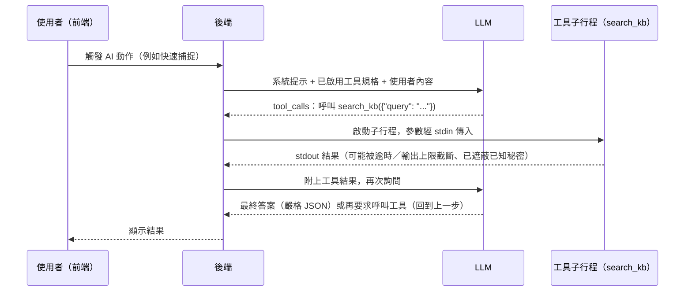

# 工具呼叫（Tool Calling）機制說明

## 1. 這是什麼

AI 回答的時候，如果遇到自己不確定的內部術語、文件或資料，可以「呼叫工具」——
也就是請後端幫忙查一份資料、把查到的內容讀進對話裡再繼續回答，而不是憑空捏造
答案。這份文件說明 afterthread 裡的工具呼叫實際上是怎麼運作的：一次呼叫從
觸發到拿到答案經過哪些步驟、有哪些安全與資源上的邊界、工具是怎麼被 AI 自己
「安裝」出來的，以及除錯時你能看到什麼紀錄。

先說在前面：這整套機制是**手工寫的一個迴圈**（`backend/afterthread/services/llm.py`），
沒有用 LangChain 之類的 agent 框架。這不是「還沒空導入框架」，而是評估過後的
決定——現有的每一條安全防線都是針對這個 app 的具體限制手工打造的，換成框架
並不會讓程式碼變少，反而會失去現在看得到、改得動的透明度。細節在第 6 節。

## 2. 一次工具呼叫的生命週期

### 觸發

這個 app **沒有聊天視窗**。**已安裝的使用者工具**只會在使用者做以下三個 AI
動作之一時被呼叫（KB 網頁安裝器內部也跑同一套工具迴圈，但用的是一組不同的
內建元工具，見第 4 節）：

- **快速捕捉**：貼一段原始討論文字，AI 整理成結構化草稿。
- **AI 補齊**：AI 依 checklist 補齊項目內容。
- **AI 進度更新**：AI 把最新進展整理成一筆進度紀錄。

這三個動作在程式碼裡分別叫 `capture`／`enrich`／`assist_update`（這個名字之後
會出現在 AI 日誌頁面裡，見第 5 節），走的是完全同一套工具呼叫機制。

### 送出「已啟用工具」的規格

呼叫 AI 之前，後端會先問工具登記表（`services/tools.py`）「現在有哪些工具是
已安裝且已啟用的」。每個工具的規格來自它自己的 `tool.json`：`name`、
`description`（給模型看的說明，告訴它什麼時候該呼叫這個工具）、`parameters`
（一份 JSON Schema，描述這個工具接受什麼參數）。這份規格會被組裝成 OpenAI
Chat Completions API 認得的 `tools` 陣列，跟系統提示、使用者內容一起送出去。

如果沒有安裝任何工具（或全部停用），系統就完全不帶 `tools` 參數——提示內容
跟「這個 app 從來沒有工具功能」時一模一樣，不會因為工具子系統存在就多花一分
token。

### 模型回覆 tool_calls

模型看到工具規格後，如果判斷需要查資料，不會直接回答，而是回一種特殊格式的
訊息：不是一段文字，而是一份「我要呼叫哪個工具、參數是什麼」的清單
（`tool_calls`）。這是 OpenAI API 的標準協定，不是這個 app 自創的格式。

以查內部知識庫為例：假設已經裝好一個叫 `search_kb` 的工具，使用者貼的討論
文字裡出現一個只有公司內部才懂的縮寫，模型可能會回一個 tool_calls，內容大致
是「呼叫 `search_kb`，參數 `{"query": "這個縮寫"}`」。

### 後端執行每個工具

後端收到 tool_calls 後，對每一個呼叫做這些事：

1. 把模型給的參數（一段 JSON 文字）解析成物件；解析失敗就直接回一個錯誤
   字串當作這次呼叫的結果，不會讓格式錯誤的參數傳進工具本身。
2. 啟動一個全新的**子行程**（subprocess）執行這個工具的 `entry`（例如
   `["python3", "run.py"]`），工作目錄設在這個工具自己的資料夾。
3. 參數 JSON 從子行程的標準輸入（stdin）餵進去，子行程印到標準輸出（stdout）
   的內容就是結果。
4. 子行程的環境變數是**從零打造**的（細節見第 3 節）。
5. 有逾時（`LLM_TOOL_TIMEOUT_SECONDS`，預設 60 秒）跟輸出長度上限
   （`LLM_TOOL_OUTPUT_MAX_CHARS`，預設 50000 字元，超過會截斷並標記
   `…[工具輸出過長已截斷]`）。
6. 不管工具本身是成功、失敗還是逾時，後端一律把結果包成一段文字（絕不讓工具
   的例外炸穿到使用者面前）：成功是 stdout 內容，失敗是
   `tool failed (exit N): <stderr>`，逾時是 `tool timed out after N seconds`。

### 結果附回對話，再問模型

每個工具呼叫的結果，會被包成一則「這是某個 tool_call 的回覆」的訊息，接在
模型剛剛那則「我要呼叫工具」的訊息後面，一起送回去再問模型一次。模型這時
看得到查詢結果，可以決定「資料夠了，直接回答」或「還要再查別的」。

### 直到給出最終答案

這個「模型要求呼叫工具 → 後端執行 → 結果回饋 → 再問模型」的循環會一直進行，
直到下列任何一個情況發生：

- 模型不再要求呼叫工具，直接給出答案；
- 工具輪數用完（`LLM_TOOL_ROUNDS_MAX`，一般 AI 動作預設 8 輪；安裝器另有更大
  的預算，見第 4 節）；
- 即時對話累積的大小超過預算（見第 3 節）；
- 整個互動的時間預算快用完。

輪數或預算用完時，後端會停止再帶 `tools` 參數，並多送一則提醒訊息（大意是：
工具預算已經用完，不要再要求呼叫工具，直接依系統指示給出最終的 JSON 答案），
逼模型收斂成答案，而不是無限迴圈下去。

最終答案必須是嚴格符合預先講好的 JSON Schema 的**一個** JSON 物件（見第 3 節
「strict JSON」）。

下面是這個生命週期的示意圖（以查 `search_kb` 為例）：

## 3. 安全與資源邊界（為什麼有這些欄杆）

每一條都先講「防什麼」，再講「怎麼做」。

- **單回覆工具數上限（16 / 64）**：一則模型回覆理論上可以同時要求呼叫好幾個
  工具（合理情境可能是幾個並行查詢），但一個故障或被誤導的模型也可能一次
  要求幾千個——這防的是「上游洪水」。真的會執行的只有前 16 個
  （`_MAX_TOOL_CALLS_PER_REPLY`），超過的每一個都會收到「too many tool
  calls」的拒絕訊息（仍然回一個結果，因為 API 規定每個 tool_calls 都要有
  對應回覆，否則下一輪的請求會被拒絕）。如果整則回覆的 tool_calls 數量超過
  64 個（`_MAX_TOOL_CALLS_ACCEPTED`），代表這則回覆本身已經不正常，後端連
  處理都不處理，直接判定為上游錯誤（`tool_calls flood`，跟解析失敗走同一條
  502 錯誤路徑）。
- **tool_calls 大小上限（約 256 KiB）**：光數量夠少還不保證安全——64 個呼叫
  還是可能夾帶巨大的參數內容。後端會把一則回覆裡所有 tool_calls 的 id、
  名稱、參數（加上模型可能一起夾帶的文字內容）加總**字元數**（不是精確的
  UTF-8 位元組數，所以全中文之類的非 ASCII 內容實際位元組可略高於此），超過 256 KiB
  就跟數量超標一樣判定為上游錯誤，防的是數量上限防不到的「參數超大」型洪水。
- **對話 token 預算（`LLM_TOOL_CONVERSATION_BUDGET_TOKENS`）**：每一輪最多
  可能疊加 16 個工具結果，跑滿輪數的話，實際送給模型的對話會越滾越大。這個
  設定（預設 500000 token）是「即時送出」這條路徑的總量煞車——量到的是
  token，但程式碼裡實際比較的是字元數，兩者之間用一個動態學到的「字元↔token
  比值」換算：每次模型回覆帶回它自己數的 `prompt_tokens`，後端就拿「這次送出
  多少字元」配「模型說這是多少 token」湊成一組觀察值，滾動平均出目前的比值
  （這是第 7 節 `LLM_PROMPT_BUDGET_TOKENS` 也共用的同一套機制）。對話換算後
  一旦超過預算，後端就不再帶工具、直接收斂成最後一次回答。
- **整體 deadline，以及「時間不夠就不啟動新工具」**：整個互動（不管跑了幾輪）
  共用同一個時間預算。這裡有一個誠實的技術限制：工具子行程是丟到一個背景
  執行緒池（threadpool）裡跑的，這個執行緒**不會**在時間到的時候被強制打斷
  （Python 的非同步逾時機制只能取消「正在等待」的程式碼，沒辦法打斷一個已經
  在執行中、佔用執行緒的子行程）。如果放任後端在時間快到時還啟動新工具，
  最壞情況是好幾個工具各自跑到自己的逾時上限，疊加起來遠超過原本說好的時間
  預算。因此後端的作法是：一旦剩餘時間不超過 1 秒，就不再啟動任何新工具呼叫，
  直接回一個「deadline reached」的結果——這樣最壞情況只會是「deadline 加上
  一個已經在跑的工具的逾時」，而不是加上一整輪工具的逾時。
- **子行程從零建構環境**：工具子行程的環境變數是從一份很短的允許清單
  （`PATH`／`HOME`／`LANG`／`LC_ALL`／`TMPDIR`）重新組出來的，從來不是把後端
  行程的整個環境變數複製過去——後端的 `OPENAI_API_KEY` 因此結構性地不存在於
  子行程裡，一個被生成出來、可能還沒完全被信任的工具沒辦法意外讀到它。要
  誠實講清楚這個防線的邊界：這防的是「意外」外洩，不是「對抗式」隔離——同一
  作業系統使用者底下的子行程理論上還是能讀到父行程的 `/proc/<pid>/environ`。
  真正的信任邊界是「只安裝你信任的 OpenAPI 文件跟指示」，環境隔離只是多一層
  防線。
- **輸出遮蔽（已知秘密進對話前被遮）**：工具的輸出、或安裝過程中元工具的
  輸出，理論上可能不小心把一個已知的機密值（後端自己的 API key、任何已安裝
  工具 `.env` 裡的值、或安裝表單裡正在使用的秘密）印出來。在這段文字進入
  對話、被模型看到之前，後端會先把所有已知機密值換成固定的遮蔽標記
  （畫面上會看到類似 `•••[秘密已遮蔽]•••` 的樣子）。兩個界線要誠實講清楚：
  (1) 只遮**長度 6 字元以上**的值——太短的值不遮（會把一般文字也切碎），而
  安裝表單的秘密欄位同樣要求至少 6 字元，所以**極短的秘密目前無法被安全遮蔽、
  也不建議用**；(2) **送進對話給模型看**的那條路徑是 fail-closed（遮蔽若出錯
  就讓該步驟失敗，不會把原值放出去）；但**存進 AI 日誌**的那條是刻意 fail-open
  （紀錄器是純觀測者，遮蔽萬一出錯時寧可存下未遮蔽的原文，也不讓「記錄」這件
  事反過來弄壞真正的 LLM 呼叫）——所以日誌的遮蔽是常態保證、不是絕對保證。
- **strict JSON + 一次修正重試**：最終答案要求是「剛好一個 JSON 物件」，格式
  在系統提示裡講得很清楚（連同這次回答該符合的 JSON Schema 一起附上）。如果
  模型的回覆解析失敗、或解析出來的物件不符合 schema，後端不會直接放棄，而是
  把模型自己剛剛的錯誤回覆、加上「哪裡錯了」的說明，重新問一次——但只有這
  一次修正的機會；如果修正後還是不對，就回一個固定、不含任何解析細節的錯誤
  （`InvalidStructuredOutput`），讓呼叫端知道這次 AI 動作失敗了。

## 4. 工具是怎麼「安裝」的

「工具」頁的「安裝新工具」，做的事情類似 Claude Code 幫你建一個 skill：使用者
貼一個 API 的 OpenAPI JSON 文件網址、加上一段指示，後端就啟動**另一個**獨立的
AI 對話（跟平常查資料的工具呼叫是不同的一次呼叫，工作流程名字叫
`tool_install`），帶著四個「元工具」（meta-tool，工具本身也是工具，但是給 AI
用來「建造」工具的）：

- `write_file` / `read_file` / `list_dir`：讀寫檔案，但路徑被強制限制在一個
  暫存工作目錄（staging）裡，不能碰到目錄外的任何東西。
- `run_shell`：一個真正的 bash shell，以後端服務自己的權限執行，只是預設從
  暫存目錄開始（這是工作慣例，不是圍籬——它能讀寫這個服務的使用者帳號能碰到
  的任何東西）。這是刻意的設計：AI 要能真的用 `curl`／`python3` 呼叫目標
  API、跑測試、看錯誤、修正，才建得出一個真正能動的工具。

這個安裝 session 有比一般 AI 動作大得多的預算（見第 7 節的 `TOOL_INSTALL_*`
設定），因為「寫檔 → 用 `run_shell` 測試 → 看錯誤修正 → 再測試」這個循環要
跑到能力所及的最好結果，通常得花上好幾輪、好幾分鐘。

AI 判定自己建好、測過、能動了以後，後端才會**驗證**這個暫存目錄：跑跟已安裝
工具一模一樣的檢查（`tool.json` 格式、名稱規則、參數 schema 大小），再加上
只有安裝時才做的更嚴格檢查，其中一條是「檔案不得內嵌秘密值」——如果 AI 不
小心（或被誤導）把一個已知的機密值原封不動寫進某個檔案的**前約 64 KiB**裡，
安裝會被直接拒絕，而不是遮蔽了事（因為這代表產出的工具本身結構有問題，遮蔽
只會讓模型建出的 schema 悄悄跟原本不一樣）。每個檔案只掃前約 64 KiB 是務實的
界線：最關鍵的 `tool.json`（會被 `/api/tools` 對外列出、也會進未來每次的工具
規格）本來就遠小於這個大小、完整涵蓋；埋在超大實作檔 64 KiB 之後的秘密則是
已知的殘餘界線。驗證通過後，暫存目錄才會被搬進正式的工具目錄。

如果使用者在安裝表單額外填了「秘密欄位」（一個名字 + 一個值，例如目標 API 的
key），這個值的處理原則是「盡量不讓模型直接拿到值」：

- 它會被注入 `run_shell` 子行程的環境變數（用使用者指定的名字），讓 AI 能夠
  用真正的 key 實測 API 呼不呼得通；
- 安裝驗證通過、確定要搬進正式目錄時，後端直接把這個值寫進這個工具自己的
  `.env`；
- 值本身**不會**出現在任何送給模型的提示文字裡，模型只看得到「有一個叫這個
  名字的秘密可以用」；系統提示也明確要求它不准印出來、不准自己寫進檔案。
- 誠實講清楚邊界：這個值確實存在於 `run_shell` 的環境變數裡，而 `run_shell`
  是模型能下指令的地方——它若刻意把值分段、編碼後輸出再重組，遮蔽器（只比對
  原值與其尾端片段）未必攔得住。系統提示的禁令是**行為指示，不是強制邊界**。
  所以最終仍回到同一個信任模型（D21）：只安裝你信任的 OpenAPI 文件與指示。

（工具套件的目錄結構、`tool.json` 欄位、操作步驟等細節，README「KB 工具安裝
指南」已經寫得很完整，這裡不重複。）

### 安裝後的 AI 總結與定版

工具搬進正式目錄之後，安裝工作還會再跑**一次獨立的**短 AI 對話（工作流程名字
叫 `tool_summary`，跟建置用的 `tool_install` 分開），把剛裝好的套件檔案讀一遍，
產生一段給人看的說明：這個工具做了什麼、運作原理（entry 怎麼跑、對外呼叫什麼
API）、輸入與輸出、限制與注意事項。系統提示要求它**只描述檔案裡看得到的事**，
看不出來的就直說看不出來——這段說明是你之後決定「留著還是改掉」的依據，猜出來
的細節比誠實承認空白更糟。

- **存在哪裡**：套件自己的 `.ai_meta.json`（隱藏檔）。工具本體就是一個檔案包，
  說明跟著它同生共死——刪掉工具，說明就一起消失，不會在資料庫裡留下孤兒。這個
  檔案 registry 掃描看不見（掃描只讀 `tool.json`），也不會被當成一個壞掉的工具
  列出來。
- **這個檔案是後端照固定格式重寫的，不是把記憶體裡的東西倒出來**：只有
  `summary`／`status`／`updated_at`／`llm_log_id`／`origin` 五個欄位，key 全是
  程式裡寫死的字面值。你可以手動編輯它（這份文件與 README 都說可以），但下一次
  後端寫入時，多加的欄位會被丟掉、型別不對的值會被收斂或整份拒絕寫入。這樣做的
  原因很實際：先前的版本是「把整個結構的每個字串都遮蔽一遍」，連 **key** 也遮，
  於是只要你安裝時填的秘密值剛好等於 `summary` 這種字（長度過得了 6 字元下限），
  寫入會「成功」但 key 被換成遮蔽標記——檔案還是合法 JSON，總結卻從此讀不出來，
  而且沒有任何地方會報錯。現在檔案裡沒有任何一個 key 來自呼叫端，這一整類問題就
  不存在了。讀寫的大小上限也是同一個數字（256 KiB）：寫得進去的一定讀得回來。
  你手動編輯這個檔案是安全的，兩個意義上：寫入是**原子的**（先寫同目錄的暫存檔、
  fsync，再用 `os.replace` 換名），所以磁碟滿或 I/O 出錯時你原本的檔案完好如初、
  也不會被讀到半份；而落單的 Unicode surrogate（`"\ud800"` 這種——它是合法 JSON，
  卻不能編成 UTF-8）在讀和寫兩端都會被換成 `�`，不會讓「工具總結」這一頁掛掉。
- **安裝網址只留出處**：記在 sidecar 裡、也餵給模型的那個 OpenAPI 網址，只保留
  `scheme://主機[:埠]`；主機之後的任何東西——路徑、`?` 後面的查詢字串、`#` 後面的
  片段、以及 `user:pass@` 這種帳密段——只要存在任何一項就一律**整段丟掉**，並在
  尾巴補一個標記讓你知道有東西被拿掉了（無法解析的網址、scheme 不是 http/https，
  或是主機看起來不像合法主機名稱的怪樣子——例如網址寫成 `https://Bearer 某個值/...`
  這種——就整個留空，絕不原樣寫出去）。這不是「遮蔽」而是「不留」，因為遮蔽在這裡
  本來就救不了：presigned 連結、路徑裡的能力型 token（例如 `;jsessionid=...`），或是
  你臨時貼上的 token 從來沒被登記成已知秘密，遮蔽器不知道那是什麼；就算登記過，
  URL 裡常常是編碼過的樣子（登記的是 `abc+/`、網址寫的是 `abc%2B%2F`），比對不會中
  ——不管這段是在查詢字串還是路徑裡。反正之後沒有任何流程會再去抓這個網址——它純粹
  是「這個工具是照哪份文件做的」的出處顯示，只要看得出是哪個主機的文件就夠——連路徑
  一起丟掉也不影響任何功能。已經存在的舊 sidecar 不用處理：讀得出來照樣讀，下次按
  「重新產生」就會順手改寫成收斂後的樣子。
  **順帶一提這條界線的另一邊**：你寫在安裝指示裡的秘密，如果是**編碼過或變形過**的
  （percent-encoding、base64、中間插空白），已知秘密遮蔽同樣抓不到——那是自由文字，
  沒有「可以整段丟掉」的部位可用。指示欄位請照舊只寫必要資訊。
- **餵給模型什麼**：`tool.json` 與各實作檔的內容、`.env` 的 **key 名稱**（值
  絕不進提示）、安裝當時的 OpenAPI 網址（收斂後的，見上）與你寫的指示，以及建置者
  自己的回報。
  sidecar 自己會被跳過——不然總結會拿上一次的總結當「原始碼」讀。所有內容都先
  遮蔽已知秘密值再截斷，總量受同一個 `LLM_PROMPT_BUDGET_TOKENS` 預算。
  順序是刻意的：**先套件本身、後安裝脈絡**。預算調小的時候截斷從尾巴開始，這個
  順序讓它先吃掉背景資訊；反過來（脈絡在前）在合法的最小預算下，模型會拿到
  **零份**套件內容，然後照著你的指示編一份聽起來很合理的說明出來——而那份說明會被
  當成總結存下來，正好違反系統提示裡「只描述檔案裡看得到的事」這條主要規則。
- **失敗不會拖累安裝**：這一步在套件已經裝好之後才跑，所以總結失敗（LLM 沒設
  定、上游掛掉、任何例外）一律就地吞掉，安裝仍然是成功的；只會留下一個空總結
  的 sidecar，等你按「重新產生」。反過來，重新產生失敗時**不會**清掉原本好好的
  總結。
- **草稿 / 定版**：總結有 `draft`（草稿）與 `final`（已定版）兩種狀態，可以隨時
  雙向切換。定版的意思就是「凍結 AI 對這個工具的迭代」——已定版時重新產生總結
  會被擋下（`409 tool_finalized`），要先解除定版。這個擋法有**兩道**，因為只有
  一道守不住：進來時先擋一次（省掉一次沒必要的 LLM 呼叫），等 LLM 回來要寫檔前
  再讀一次狀態。少了第二道的話，你在總結產生途中按下定版，剛產生的文字照樣會蓋
  掉你剛剛凍結的那份——狀態是 `final` 沒錯，內容卻換人了，那就不叫凍結。
  反方向不對稱是故意的：只有「定版」需要先有內容（空的總結不給定版，否則會被自己
  鎖死——定版後連重新產生都被擋，就再也填不進去了），「解除定版」永遠可以按。
  另外，只要有工具工作正在跑，
  重新產生也會被擋（`409 tool_job_in_progress`）：安裝的最後一步是把整個目錄搬
  進位，在那個交換窗口裡讀寫同一個套件的檔案是在跟自己賽跑。
- **重新產生是同步的**：它只是一次單輪生成（沒有工具迴圈、沒有 shell），所以就
  像快速捕捉那樣在同一個請求裡等完，LLM 沒設定／上游失敗直接回 503／502，而不是
  像安裝那樣包成背景工作。
### 依你的意見修訂既有工具

看完總結覺得「查詢結果太囉嗦」「要加上分頁」，可以直接把意見送出去
（`POST /api/tools/{name}/revise`），後端會開一次**跟安裝同一種**的建造者對話
（同樣四個元工具、同樣的 `tool_install` 工作流程名與預算），只是這次工作區裡
**已經放著這個工具的檔案**，任務從「建一個工具」變成「照這段意見改這個工具」。
改完之後，新的套件**整包換掉**正式目錄裡的舊套件。

幾個刻意的設計，都是為了「正在服役的工具不能被改壞」：

- **根層 `.env` 不進工作區，也不由模型改寫**。複製套件到暫存目錄時，**套件根層的
  `.env`** 與 AI 總結 sidecar（後者在任何層級）都會被排除。根層 `.env` 一定得排除，
  理由很實際：它的值就在「已知秘密」集合裡，複製進去之後必然會被安裝驗證的「檔案
  不得內嵌秘密值」那一關擋下——等於這個工具從此再也修訂不了。等新套件通過驗證之後、
  換裝之前，後端再用 `shutil.copy2` 把**正式套件的那個檔案逐位元組複製回暫存區**：
  不解碼、不重新編碼，位元組連同權限與 mtime 原樣過去（模型自己寫的 `.env` 一律被
  覆蓋）。之所以不是「讀成文字再寫回」，是因為工具的 entry 就是以**套件目錄**當工作
  目錄執行的，它大可自己用二進位模式打開 `.env` 去雜湊或比對——這個檔案的位元組不是
  一次「只想加分頁」的修訂可以順手正規化的東西。系統
  提示會明講這件事，並告訴模型那些值**已經在 run_shell 的環境變數裡**（名字照舊），
  所以它照樣能拿真的 key 實測 API，只是從頭到尾看不到值。要換秘密值請自己編輯
  該工具的 `.env`，這是 v1 明說接受的限制——但**手寫的值長度至少要 6 字元**：
  遮蔽器對更短的值一律略過（不然「1234」這種字串會把散文洗成一片遮蔽標記），
  而修訂會把 `.env` 的值餵進 `run_shell`，遮不掉就會隨輸出進到下一輪提示與 AI
  日誌，所以太短的值會讓修訂在開工前就被拒絕（安裝表單本來就擋這件事，這是同一
  條規則套在另一個入口）。同理，`.env` 存在但**讀不到值**（symlink、權限錯誤、超過
  大小上限）也是整場拒絕，而不是當成「這個工具沒有 `.env`」。
- **巢狀的 `.env` 是普通套件內容，會照常複製**。工具自己讀的 `config/.env` 之類的檔案
  不歸後端管，也不在「已知秘密」集合裡（那個集合只讀每包**根層**的 `.env`），所以修訂
  不會動它。如果它裡面剛好內嵌了一個已登記的秘密值，promote 會被內嵌秘密閘擋下並指出
  是哪個檔案——那是閘門在做它該做的事（也是在告訴你，你把 live 憑證放進了第二個檔案），
  比「靜默把那個檔案刪掉、然後驗證通過」好得多。
- **模型不准改名**。它回報的 `tool_name` 必須等於被修訂的那個套件名，否則整次
  修訂作廢——這個欄位決定的是「要替換哪一包」，不是模型的創作空間。
- **換裝是可回復的**：舊套件先改名成一個隱藏的備份目錄（隱藏所以工具列表看不到
  它），新套件再**用一次 `os.rename` 就位**，成功就刪掉備份、失敗就把備份改回來。
  驗證沒過、原套件中途被你刪掉、就位失敗——**都不會**動到正在服役的那一包。
  就位刻意不用 `shutil.move`：它在 `os.rename` 失敗時會退化成「複製再刪除」，
  複製到一半就會有半套目錄佔住工具的名字，備份反而還原不回去。整段換裝期間，
  舊套件 `.env` 的每個值都被登記成「進行中的秘密」，因為已知秘密掃描會跳過隱藏
  目錄，不補這一手，交換的那個瞬間就會有一段沒被遮蔽的空窗。
- **修訂完會重新產生總結**：sidecar 沒被複製進工作區，所以換裝後那一刻它是沒有
  總結的，接著由後端重新產生一份（狀態回到 `draft`，並沿用原本記著的安裝出處）。
  已定版的工具不能修訂（`409 tool_finalized`），要先解除定版——這正是「定版＝凍結
  AI 迭代」的意思。
- **一次只跑一個**：修訂和安裝共用同一張工作表與同一個輪詢端點
  （`GET /api/tools/jobs/{job_id}`），任何一個工作在跑的時候都擋下新的工作，也
  擋下「重新產生總結」——搬整個目錄的那個窗口裡，同時讀寫同一個套件是在跟自己
  賽跑。

## 5. AI 日誌怎麼配合除錯

「AI 日誌」頁記錄每一次 AI 互動——不管是快速捕捉、AI 補齊、AI 進度更新，還是
工具安裝的建置過程——而且是記錄到**每一個 attempt**（每一輪工具呼叫、每一次
修正重試都是獨立的一個 attempt），可以攤開來看每一輪實際送出的內容、模型的
回覆、有沒有出錯。日誌只保留最近 `LLM_LOG_MAX_ENTRIES`（預設 50）筆互動紀錄，
存在記憶體裡的環狀緩衝區，後端程序重啟就會清空；只有另外設定了
`LLM_LOG_FILE`，才會額外把完整紀錄落地成檔案。

幾個影響你看到什麼的規則：

- 每一則存進紀錄的文字，都會先做已知機密遮蔽（跟第 3 節工具輸出的遮蔽是
  同一套邏輯、同一個遮蔽標記，但此處是 fail-open——見第 3 節：遮蔽萬一出錯時
  紀錄器寧可存原文也不弄壞 LLM 呼叫），再檢查過編碼安全性，最後按
  `LLM_LOG_BODY_MAX_CHARS`（預設 200000 字元）截斷——超過的部分會被標記
  截斷（`…[紀錄過長已截斷]`），不是無聲消失。
- 工具呼叫的參數，在合成的「這輪呼叫了哪些工具」摘要裡只保留前 **200 個
  字元**的預覽。要留意：**日誌本身只存這段 200 字元預覽**——紀錄器只保留每則
  訊息的角色與內容，不保存 tool_calls 結構本身，所以日誌裡看不到完整參數
  （完整參數只存在於當下實際送給模型的對話裡，不在事後可翻閱的紀錄裡）。
- 每一輪 attempt 另外記下**當輪廣告給模型的工具名單**（`tools_advertised`），
  日誌頁會在該輪的統計行下面用標籤列出來。工具規格是跟著 API 參數送的、不在
  訊息內容裡，所以這是唯一能看出「模型當下看得到哪些工具」的地方。值為 `null`
  代表那一輪完全沒送工具參數——例如沒有啟用任何工具、輪次或篇幅預算用完後的
  收尾那一輪、以及格式修正重試的那一輪。只記名稱不記完整規格：單一工具的參數
  schema 可以很大，逐輪重複存會把紀錄撐爆，要看細節的話工具包裡的 `tool.json`
  就是原件。
- 一次互動如果跑了很多輪、累積下來的內容超過同一個字元上限，比較舊的訊息
  會被摺疊成一則「較早 N 則訊息已省略以控制紀錄大小」的合成訊息，而不是讓
  單筆紀錄無限脹大。
- 工具安裝的結果，只要 AI 建置階段真的開始跑了，就會附上一個直接跳到 AI
  日誌並展開該筆紀錄的連結（deep link），失敗時這通常是最主要的除錯入口。

## 6. 為什麼不用 LangChain

這一題是使用者自己提出來評估的：「用 LangChain 串會更好更簡潔嗎？」完整的
評估過程記錄在 [`web-v3-decisions.md`](web-v3-decisions.md) 的 D35；這裡只講
給一般讀者的結論。

現在這個手寫迴圈裡的每一條護欄——第 3 節列的那些——都是針對這個 app 的具體
限制量身打造的：多大的輸出算洪水、多久算逾時、哪些值算機密、時間不夠時該
怎麼收斂。這些規則框架不會天生就懂，換成框架之後，一樣得在框架自己的擴充點
（例如 middleware 掛勾）重新刻一遍——程式碼行數不會變少，只是搬了個地方寫，
還多了一層框架本身的抽象要學、要信任。

其中有一條規則甚至跟主流框架的預設行為直接衝突：「時間不夠就不啟動新工具」
這件事，前提是同一輪裡的多個工具呼叫要**依序**一個一個啟動、每啟動一個都
檢查一次剩餘時間。但主流 agent 框架對同一則回覆裡的多個工具呼叫，預設是
**並行**派發出去的——要保留這條規則，就得換掉框架內建的執行路徑，自己重寫
一個依序執行的節點，等於把現有邏輯原封不動塞進框架的殼子裡，並沒有真的變
簡單。

框架真正擅長的地方——同時支援好幾家不同 AI 供應商、可以中途存檔恢復、人在
迴圈中審核、逐步驟串流輸出——這個 app 一條都用不到：這裡永遠只對一個固定的
OpenAI-compatible 端點、一個固定模型講話，沒有多供應商熱插拔的需求，也沒有
需要跨行程恢復的長任務。

結論是：把現成的、看得懂、改得動的安全邏輯換成框架的不透明封裝，並不會讓
事情變得「更好更簡潔」——說明白一點，比包起來好。如果以後真的出現第二個
協定不同的 AI 供應商，或者需要專門的可觀測性工具，這個結論值得重新評估，
但目前不成立。完整評估見 D35。

## 7. 相關設定速查

以下設定都在 `backend/afterthread/env.example` 裡（實際生效值與邊界以
`backend/afterthread/config.py` 為準）：

| 設定 | 預設值 | 說明 |
| --- | --- | --- |
| `LLM_TOOL_ROUNDS_MAX` | 8 | 一次 AI 呼叫最多允許幾輪工具呼叫，用完就強制模型直接給答案。 |
| `LLM_TOOL_TIMEOUT_SECONDS` | 60 | 單一工具子行程的逾時秒數，超過就整個行程群組被強制結束。 |
| `LLM_TOOL_OUTPUT_MAX_CHARS` | 50000 | 工具輸出（stdout）餵回模型前的字元上限，超過會被截斷並標記。 |
| `LLM_TOOL_CONVERSATION_BUDGET_TOKENS` | 500000 | 工具迴圈裡「即時送給模型」的對話大小的 token 預算，換算成字元後拿來比對，超過就停止再帶工具。 |
| `LLM_PROMPT_BUDGET_TOKENS` | 200000 | 提示裡可以塞入的內容（項目快照、安裝器讀到的 OpenAPI 文件）的 token 預算。 |
| `TOOLS_DIR` | （空，關閉） | 工具套件存放的目錄；留空代表整個工具功能關閉，AI 完全不會看到任何工具。 |
| `TOOL_INSTALL_MAX_ROUNDS` | 24 | 安裝一個工具時，建置 session 的工具輪數預算（比一般 AI 動作大很多，因為要反覆寫檔測試）。 |
| `TOOL_INSTALL_TIMEOUT_SECONDS` | 900 | 整個安裝 session 的總時間上限（15 分鐘）。 |
| `TOOL_INSTALL_SHELL_TIMEOUT_SECONDS` | 120 | 安裝過程中單一 `run_shell` 指令的逾時秒數。 |
